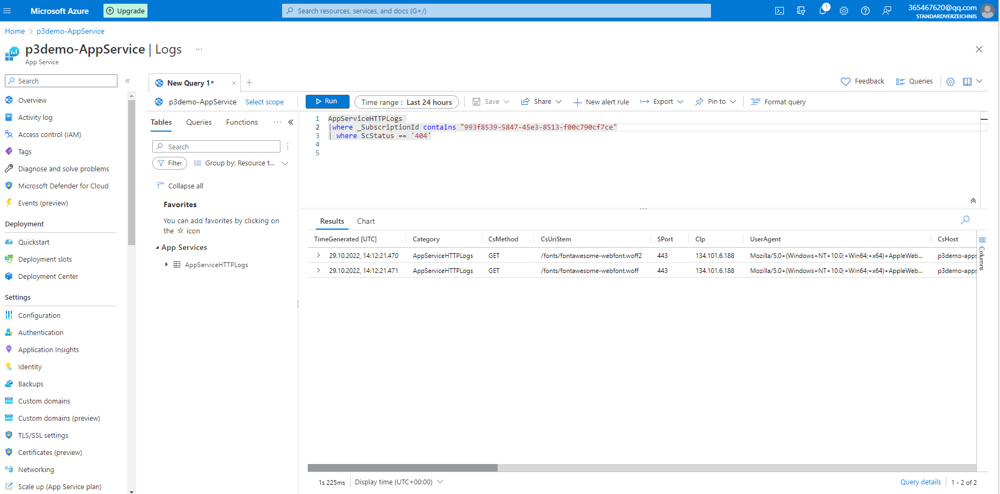

# Ensuring Quality Releases Project


## Introduction 
In this project, you'll develop and demonstrate your skills in using a variety of industry leading tools, especially Microsoft Azure, to create disposable test environments and run a variety of automated tests with the click of a button. Additionally, you'll monitor and provide insight into your application's behavior, and determine root causes by querying the application’s custom log files.


## Project Dependencies
- [Terraform](https://www.terraform.io/downloads.html)
- [JMeter](https://jmeter.apache.org/download_jmeter.cgi)
- [Postman](https://www.postman.com/downloads/)
- [Python](https://www.python.org/downloads/)
- [Selenium](https://sites.google.com/a/chromium.org/chromedriver/getting-started)

## Prerequisites
- [Azure Account](https://portal.azure.com) 
- [Azure Command Line Interface](https://docs.microsoft.com/en-us/cli/azure/install-azure-cli?view=azure-cli-latest)
- [Azure DevOps Account](https://dev.azure.com/) 

## Steps 

### Azure Configuration

Login to your Azure account 

``` bash
az login 
```

Create service principal or use the one your already have 

``` bash
az ad sp create-for-rbac --name ensuring-quality-releases-sp --role="Contributor" --scopes="/subscriptions/SUBSCRIPTION_ID"
```

Below command will be generated 

``` json
{
  "appId": "00000000-0000-0000-0000-000000000000",
  "displayName": "azure-cli-2017-06-05-10-41-15",
  "name": "http://azure-cli-2017-06-05-10-41-15",
  "password": "0000-0000-0000-0000-000000000000",
  "tenant": "00000000-0000-0000-0000-000000000000"
}
``` 

Create a config.sh file inside terraform directory, Cd inside the terraform directory and run 

```bash
bash config.sh
```

Create an azsecret.conf which will contains variables to be uploaded and use our pipeline as group variable 


Go to your local terminal and create SSH key that the VM will use to Login, A public key (id_rsa.pub) and A private key (id_rsa) will be created and save.

```bash
cd ~/.ssh/
```

```bash
ssh-keygen -t rsa -b 4096 -f az_eqr_id_rsa
```

### Azure Pipeline Building
#### Azure Pipeline Configuration


#### Terrafrom apply


#### Deployed Webapp


### Testing 

#### Regression test 


#### Validation test 


#### Publish Test Results


#### Selenium Test Result


### Stages in Azure Pipeline 


### Creating Log Analytics workspace 

You con create LAW from the portal, once the LAW is created, goto Agents management > Linux server > Log Analytics agent instructions > Download and onboard agent for Linux

SSH into the VM created above (Under test) and install the OSMAgent.

```bash 
wget https://raw.githubusercontent.com/Microsoft/OMS-Agent-for-Linux/master/installer/scripts/onboard_agent.sh && sh onboard_agent.sh -w 0ca00083-6708-4862-871d-6ba01ed6f0d8 -s p6HsJnyMJOY3sZRGCyNIkwcQo+UkXL9i8GOrf5wDgzM5JSikM5oY+8k2bfI2uejLsyMu3ra5Y7SlrtiUFX/B2Q== -d opinsights.azure.com
```

#### Create a new alter for the App Service
- a) From the [Azure Portal](https://portal.azure.com) go to:<br/>
`Home > Resource groups > "RESOURCE_GROUP_NAME" > "App Service Name" > Monitoring > Alerts`
- b) Click on `New alert rule`
- c) Double-check that you have the correct resource to make the alert for.
- d) Under `Condition` click `Add condition`
- d) Choose a condition e.g. `Http 404`
- e) Set the `Threshold value` to e.g. `1`. (You will get altered after two consecutive HTTP 404 errors)
- f) Click `Done`

#### Create a new action group for the App Service
- a) In the same page, go to the `Actions` section, click `Add action groups` and then `Create action group`
- b) Give the action group a name e.g. `http404`
- c) Add an **Action name** e.g. `HTTP 404` and choose `Email/SMS message/Push/Voice` in **Action Type**.
- d) Provide your email and then click `OK`

 

#### Create AppServiceHTTPLogs

Go to the `App service > Diagnostic Settings > + Add Diagnostic Setting.` Tick `AppServiceHTTPLogs` and Send to Log Analytics Workspace created on step above and `Save`.

Go back to the `App service > App Service Logs` . Turn on Detailed `Error Messages` and `Failed Request Tracing` > `Save`. Restart the app service.

#### Setting up Log Analytics 

Set up custom logging, in the log analytics workspace go to `Settings > Custom Logs > Add + > Choose File`. Select the file selenium.log > Next > Next. Put in the following paths as type Linux:

```
/var/log/selenium/selenium.log
```

I called it `selenium_CL`, Tick the box Apply below configuration to my Linux machines.

 


Go back to Log Analytics workspace and run below query to see Logs 

```bash
AppServiceHTTPLogs 
|where _SubscriptionId contains "d49264d6-43a4-4c49-a3fd-4b74ad940d69"
| where ScStatus == '404'

```

 


Go back to the App Service web page and navigate on the links and also generate 404 not found , example:

```bash 
https://project3demo-appservice.azurewebsites.net/sheeeeee

https://project3demo-appservice.azurewebsites.net/first page
```
After the trigger, check the email configured since an alert message will be received. 


#### URL Used for the project 
 Postman: https://dummy.restapiexample.com/api/v1/create
 Selemium: https://www.saucedemo.com/
 Jmeter: Delpoyed webapp -  http://project3demo-appservice.azurewebsites.net/ (Bringing down soon)


#### Helpful resources from Microsoft
- [Example setup using GitHub](https://learn.microsoft.com/en-us/azure/devops/pipelines/tasks/utility/install-ssh-key?view=azure-devops#example-setup-using-github)
- [Environment - virtual machine resource](https://learn.microsoft.com/en-us/azure/devops/pipelines/process/environments-virtual-machines?view=azure-devops)
- [Set secret variables](https://learn.microsoft.com/en-us/azure/devops/pipelines/process/variables?tabs=yaml%2Cbatch&view=azure-devops&preserve-view=true#secret-variables)
- [Design a CI/CD pipeline using Azure DevOps](https://docs.microsoft.com/en-us/azure/architecture/example-scenario/apps/devops-dotnet-webapp)
- [Create a CI/CD pipeline for GitHub repo using Azure DevOps Starter](https://docs.microsoft.com/en-us/azure/devops-project/azure-devops-project-github)
- [Create a CI/CD pipeline for Python with Azure DevOps Starter](https://docs.microsoft.com/en-us/azure/devops-project/azure-devops-project-python?WT.mc_id=udacity_learn-wwl)
